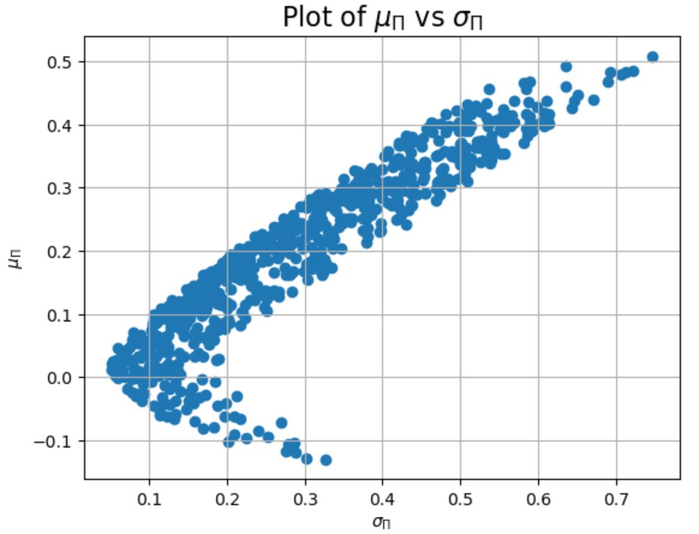
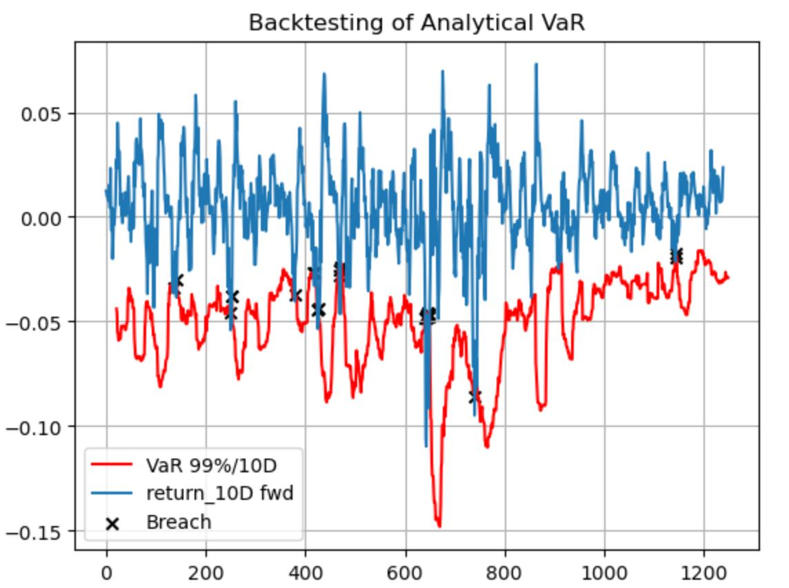
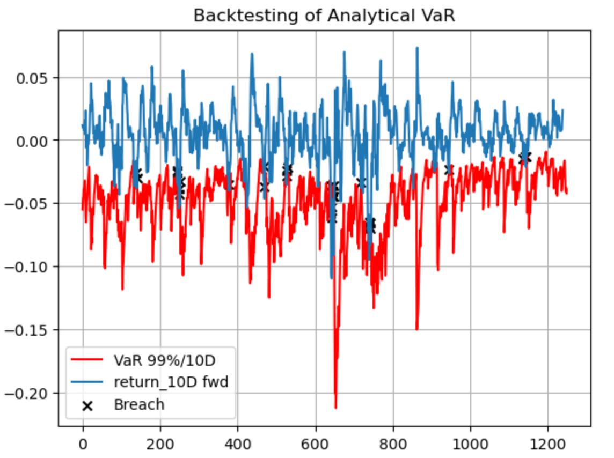

# **CQF Exam One Solution**
## January 2025 Cohort
### Siddharth Barnawal

---

# **Optimal Portfolio Allocation**

## 1) 
We formulate the minimum variance portfolio as:

$$
\arg\min_{w} \frac{1}{2} w' \Sigma w
$$

Subject to:
$$
w' \mathbf{1} = 1, \quad \mu_{\pi} = w' \mu = m
$$

#### The Lagrangian multiplier of this minimum variance portfolio is:

$$
L(w, \lambda, \gamma) = \frac{1}{2} w' \Sigma w + \lambda (1 - w' \mathbf{1}) + \gamma (m - w' \mu)
$$

#### The partial derivatives are:

$$
\frac{\partial L(w, \lambda, \gamma)}{\partial w} = \Sigma w - \lambda \mathbf{1} - \gamma \mu \quad (1)
$$

$$
\frac{\partial L(w, \lambda, \gamma)}{\partial \lambda} = 1 - w' \mathbf{1} \quad (2)
$$

$$
\frac{\partial L(w, \lambda, \gamma)}{\partial \gamma} = m - w' \mu \quad (3)
$$

#### Optimal Weight Allocation

From equation (1),

The optimal weight allocation is:

$$
w^* = \Sigma^{-1} (\lambda \mathbf{1} + \gamma \mu)
$$

Substituting the value of \( w^* \) in the constraints:

$$
\mu' w = m \quad \text{and} \quad \mathbf{1}' w = 1
$$

$$
\mu' \Sigma^{-1} (\lambda \mathbf{1} + \gamma \mu) = \lambda \mu' \Sigma^{-1} \mathbf{1} + \gamma \mu' \Sigma^{-1} \mu = m
$$

$$
\mathbf{1}' \Sigma^{-1} (\lambda \mathbf{1} + \gamma \mu) = \lambda \mathbf{1}' \Sigma^{-1} \mathbf{1} + \gamma \mathbf{1}' \Sigma^{-1} \mu = 1
$$

Solving for \( \lambda \) and \( \gamma \):

$$
\lambda = \frac{(\mu' \Sigma^{-1} \mu) - (\mathbf{1}' \Sigma^{-1} \mu) \cdot m}{(\mathbf{1}' \Sigma^{-1} \mathbf{1}) (\mu' \Sigma^{-1} \mu) - (\mathbf{1}' \Sigma^{-1} \mu)^2}
$$

$$
\gamma = \frac{(\mathbf{1}' \Sigma^{-1} \mathbf{1}) \cdot m - (\mathbf{1}' \Sigma^{-1} \mu)}{(\mathbf{1}' \Sigma^{-1} \mathbf{1}) (\mu' \Sigma^{-1} \mu) - (\mathbf{1}' \Sigma^{-1} \mu)^2}
$$

Optimal Weights:

$$
w^* =
\begin{bmatrix}
-7.92630392 \\
-0.98068924 \\
0.18958165 \\
0.47620601
\end{bmatrix}
$$

## 2) 
The shape of the plot \( \mu \) vs \( \sigma \) is found to be Elliptical. In the plot, we can find an efficient frontier from the origin to the upward direction.

# **Products and Market Risk**

## 3) 
The **VaR** with regard to each asset is calculated as:

$$
\frac{\partial VaR(w)}{\partial w_i} = \mu_i + \text{Factor} \times \frac{(\Sigma w)_i}{\sqrt{w^T \Sigma w}}
$$

where the factor is determined by the standard normal distribution,

$$
\frac{\partial VaR(w)}{\partial w_i} = \mu_i + \Phi(1 - 0.99) \times \frac{(\Sigma w)_i}{\sqrt{w^T \Sigma w}}
$$

Similarly, the **Expected Shortfall (ES)** with regard to each asset is calculated as:

$$
\frac{\partial ES(w)}{\partial w_i} = \mu_i - \frac{\phi(\text{Factor})}{1 - c} \times \frac{(\Sigma w)_i}{\sqrt{w^T \Sigma w}}
$$

$$
\frac{\partial ES(w)}{\partial w_i} = \mu_i - \frac{\phi \left( \Phi(1 - 0.99) \right)}{1 - 0.99} \times \frac{(\Sigma w)_i}{\sqrt{w^T \Sigma w}}
$$

### VaR and ES Sensitivity Table

| Asset | VaR Sensitivity       | ES Sensitivity       |
|-------|-----------------------|----------------------|
| 1     | -0.6838647463691414   | -0.7834795763585853 |
| 2     | -0.3867988051998241   | -0.4431416674758421 |
| 3     | -0.22070940469615322  | -0.25285893417929894 |

---

### Fixing Equations in Other Sections:
- Replaced `\quad` inside math mode (`$...$`).
- Removed unnecessary `\$` symbols.
- Corrected images by ensuring proper Markdown syntax.

## 6) 
The total number of VaR breaches is **25** and the percentage of VaR breaches is **2.0508%**. The total number of consecutive VaR breaches is **14**, with a percentage of **1.1484%**.

## 7) 
The total number of VaR breaches is **32** and the percentage of VaR breaches is **2.5620%**. The total number of consecutive VaR breaches is **17**, with a percentage of **1.3610%**.

