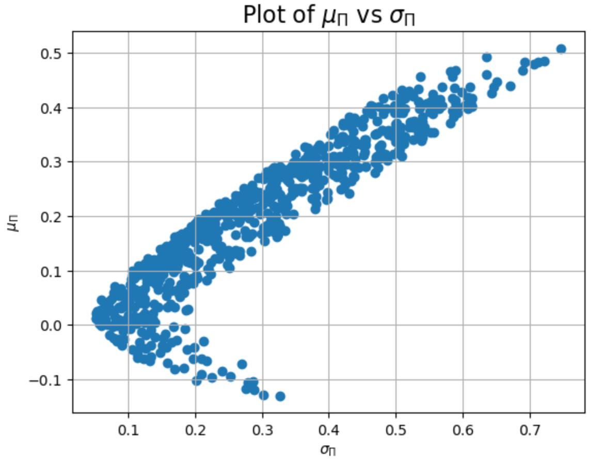
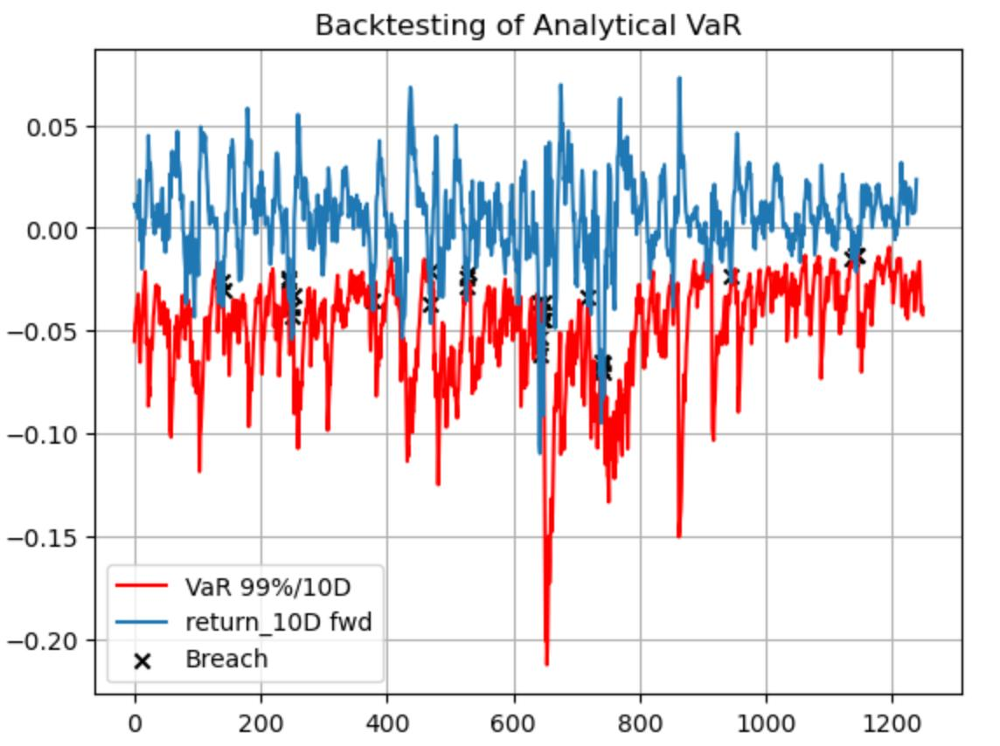

# $\quad$ $\quad$ $\quad$ $\quad$ **CQF Exam One Solution**
## $\quad$ $\quad$ $\quad$ $\quad$ $\quad$ $\quad$ $\quad$  January 2025 Cohort
### $\quad$ $\quad$ $\quad$ $\quad$ $\quad$ $\quad$ $\quad$ $\quad$ $\quad$ Siddharth Barnawal

---
 
#  **Optimal Portfolio Allocation**

## 1) 
We formulate the minimum variance portfolio as:

   
 $\quad$ $\quad$$\quad$  $\arg\min_{w}$ $\frac{1}{2}$ w' $\Sigma w$

      Subject to:

$\quad$ $\quad w' \mathbf{1}$ = 1, $\quad$ 
 $\mu_{\pi} = w' \mu = m$

#### The Lagrangian multiplier of this minimum variance portfolio is:
$$
\quad L(w, \lambda, \gamma) = \frac{1}{2} w' \Sigma w + \lambda (1 - w' \mathbf{1}) + \gamma (m - w' \mu)
$$

####  The partial derivatives are:
$$
\quad \frac{\partial L(w, \lambda, \gamma)}{\partial w} = \Sigma w - \lambda \mathbf{1} - \gamma \mu \quad (1)
$$

$$
\quad \frac{\partial L(w, \lambda, \gamma)}{\partial \lambda} = 1 - w' \mathbf{1} \quad (2)
$$

$$
\quad \frac{\partial L(w, \lambda, \gamma)}{\partial \gamma} = m - w' \mu \quad (3)
$$

#### Optimal Weight Allocation

From equation (1),

- The optimal weight allocation is:
$$
w^* = \Sigma^{-1} (\lambda \mathbf{1} + \gamma \mu)
$$

$$ \quad Substituting \quad the \quad value \quad of\quad  w^*\quad  in\quad the \quad constraints:
$$

$\quad$ $\mu'$ w = m $\quad$ $\text{and}$ $\quad$ $\mathbf{1}'$ w = 1

$$
\quad \mu' \Sigma^{-1} (\lambda \mathbf{1} + \gamma \mu) = \lambda \mu' \Sigma^{-1} \mathbf{1} + \gamma \mu' \Sigma^{-1} \mu = m
$$

$$
\quad \mathbf{1}' \Sigma^{-1} (\lambda \mathbf{1} + \gamma \mu) = \lambda \mathbf{1}' \Sigma^{-1} \mathbf{1} + \gamma \mathbf{1}' \Sigma^{-1} \mu = 1
$$

Solving for  $\lambda$  and $\gamma$ :

$$
\lambda = \frac{(\mu' \Sigma^{-1} \mu) - (\mathbf{1}' \Sigma^{-1} \mu) \cdot m}{(\mathbf{1}' \Sigma^{-1} \mathbf{1}) (\mu' \Sigma^{-1} \mu) - (\mathbf{1}' \Sigma^{-1} \mu)^2}
$$

$$
\gamma = \frac{(\mathbf{1}' \Sigma^{-1} \mathbf{1}) \cdot m - (\mathbf{1}' \Sigma^{-1} \mu)}{(\mathbf{1}' \Sigma^{-1} \mathbf{1}) (\mu' \Sigma^{-1} \mu) - (\mathbf{1}' \Sigma^{-1} \mu)^2}
$$

$$
w^* = \begin{bmatrix}
-7.92630392 \\
-0.98068924 \\
0.18958165 \\
0.47620601
\end{bmatrix}
$$

## 2) 
  $\quad$  The shape of the plot $\mu$ __vs__ $\sigma$ is found to be Elliptical. In the plot, we can find an efficient frontier from the origin to the upward direction.

  

# **Products and Market Risk**

## 3)
The **VaR** with regard to each asset is calculated as:

$$
\quad \frac{\partial VaR(w)}{\partial w_i} = \mu_i + \text{Factor} \times \frac{(\Sigma w)_i}{\sqrt{w^T \Sigma w}}
$$

where the factor is determined by the standard normal distribution,

$$
\quad \frac{\partial VaR(w)}{\partial w_i} = \mu_i + \Phi(1 - 0.99) \times \frac{(\Sigma w)_i}{\sqrt{w^T \Sigma w}}
$$

Similarly, the **Expected Shortfall (ES)** with regard to each asset is calculated as:

$$
\quad  \frac{\partial ES(w)}{\partial w_i} = \mu_i - \frac{\phi(\text{Factor})}{1 - c} \times \frac{(\Sigma w_i)}{\sqrt{w^T \Sigma w}}
$$

$$
\quad \frac{\partial ES(w)}{\partial w_i} = \mu_i - \frac{\phi \left( \Phi(1 - 0.99) \right)}{1 - 0.99} \times \frac{(\Sigma w)_i}{\sqrt{w^T \Sigma w}}
$$

### VaR and ES Sensitivity Table

| Asset | VaR Sensitivity       | ES Sensitivity       |
|-------|-----------------------|----------------------|
| 1     | -0.6838647463691414   | -0.7834795763585853 |
| 2     | -0.3867988051998241   | -0.4431416674758421 |
| 3     | -0.22070940469615322  | -0.25285893417929894 |

## 4)

The **Expected Shortfall (ES)** is calculated as:

$$
ES_c(X) = \mu - \sigma \frac{\phi(\Phi^{-1} (1 - c))}{1 - c}
$$

where \( c \) is the range of percentiles:

$$
[99.95, 99.75, 99.5, 99.25, 99, 98.5, 98, 97.5]
$$

### Expected Shortfall Table

| Percentile | Expected Shortfall |
|------------|-------------------|
| 99.95      | -3.55438          |
| 99.75      | -3.10436          |
| 99.5       | -2.89195          |
| 99.25      | -2.76124          |
| 99         | -2.66521          |
| 98.5       | -2.5247           |
| 98         | -2.42091          |
| 97.5       | -2.3378           |

## 5) 
#### Given Condition:
  
$$
\quad \quad \alpha_{i+1} = \lambda \alpha_i\, \quad \text{where } \lambda \in (0,1)$$

$$
\quad  \alpha_2 = \lambda \alpha_1
$$

$$
\quad  \alpha_3 = \lambda \alpha_2 = \lambda^2 \alpha_1
$$

$$
\quad \alpha_4 = \lambda \alpha_3 = \lambda^3 \alpha_1
$$
   
   $\quad$  $\quad$  $\quad$  $\quad$  $\quad$  $\quad$  $\quad$  $\quad$  $\quad$  $\quad$  $\quad$.$\quad$ $\quad$ .$\quad$ $\quad$ .

   $\quad$  $\quad$  $\quad$  $\quad$  $\quad$  $\quad$  $\quad$  $\quad$  $\quad$  $\quad$  $\quad$.$\quad$ $\quad$ .$\quad$ $\quad$ .
   
   

$\quad$ Since $\alpha$ is the weight of assets,

$$
\quad \quad \sum_{i=1}^{n->\infty} \alpha_i = 1
$$

$$
\quad \quad \alpha_1 + \alpha_2 + \alpha_3 + \alpha_4 + \dots = 1
$$

$$ 
\quad \quad \alpha_1 + \lambda \alpha_1 + \lambda^2 \alpha_1 + \lambda^3 \alpha_1 + \dots = 1
$$

$\quad$ Since the above equation is the sum of a geometric progression,

$$
\quad \quad \quad \frac{\alpha_1}{1 - \lambda} = 1
$$

$$
\quad \quad \quad \alpha_1 = 1 - \lambda \quad \quad \quad \quad (1)
$$

### Deriving the EWMA Model Equation:

$$
\quad \quad \sigma_t^2 = \alpha_1 u_{n-1}^2 + \alpha_2 u_{n-2}^2 + \alpha_3 u_{n-3}^2 + \alpha_4 u_{n-4}^2 + \dots
$$

$$
\quad \quad = \alpha_1 u_{n-1}^2 + \lambda \alpha_1 u_{n-2}^2 + \lambda^2 \alpha_1 u_{n-3}^2 + \dots \quad (2)
$$

#### $\quad$ Shifting the Equation (2) by \( t-1 \)

$$
\quad \quad \sigma_{t-2}^2 = \alpha_2 u_{n-2}^2 + \alpha_2 u_{n-3}^2 + \alpha_3 u_{n-4}^2 + \dots 
$$

$$
\quad \quad \lambda \sigma_{t-2}^2 = \lambda \alpha_1 u_{n-2}^2 + \lambda \alpha_2 u_{n-3}^2 + \lambda \alpha_3 u_{n-4}^2 + \dots
$$

$$
\quad \quad = \lambda \alpha_1 u_{n-2}^2 + \lambda^2 \alpha_1 u_{n-3}^2 + \lambda^3 \alpha_1 u_{n-4}^2 + \dots
$$

$$
\quad \quad \quad \quad \quad \quad \quad \quad \quad \quad \quad \quad \quad \quad \quad   (3)
$$

#### $\quad$ Substituting Equation (3) into (2)

$$
\quad \quad \sigma_t^2 = \alpha_1 u_{t-1}^2 + \lambda \sigma_{t-1}^2
$$

$$
\quad \quad \sigma_t^2 = \lambda \sigma_{t-1}^2 + (1 - \lambda) u_{t-1}^2
$$

$$
\quad \quad \quad \quad \quad \quad \quad \quad \quad \quad \quad \quad \quad \quad \quad [\text{From Equation (1)}]
$$

# **VaR Backtesting**
## 6)
  The total number of VaR breaches is **25** and the  percentage of VaR breaches is **2.0508%**. And, the total number of Consecutive VaR breaches is **14**  and the perecentage of Consecutive VaR breaches is **1.1484%**.

  

## 7)
The total number of VaR breaches is **32** and the percentage of VaR breaches is **2.5620%**. And, the total number of Consecutive VaR breaches is **17** and the perecentage of consecutive VaR breaches is **1.3610%**.
